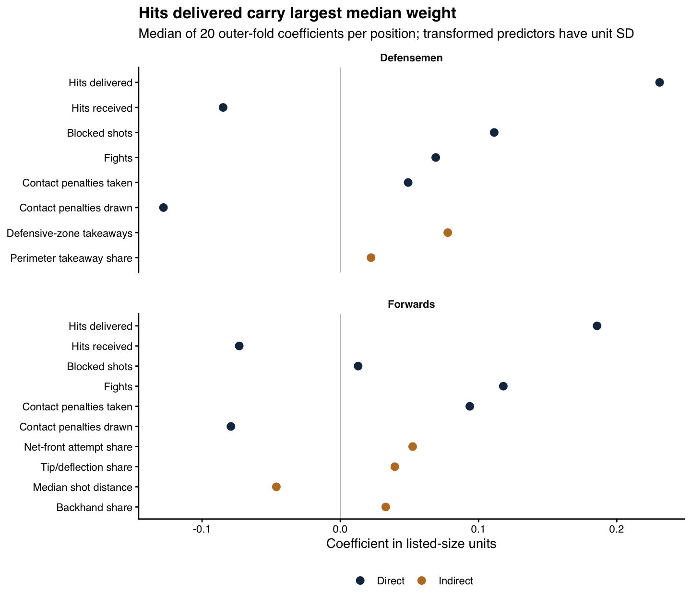
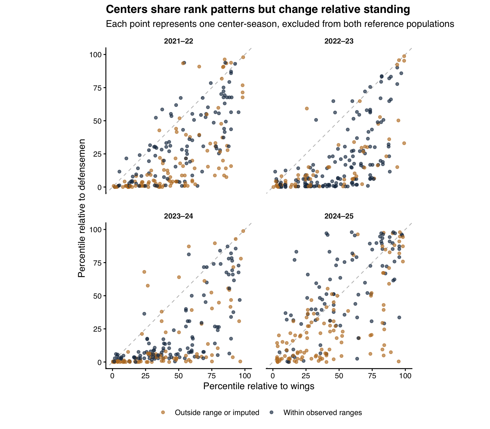
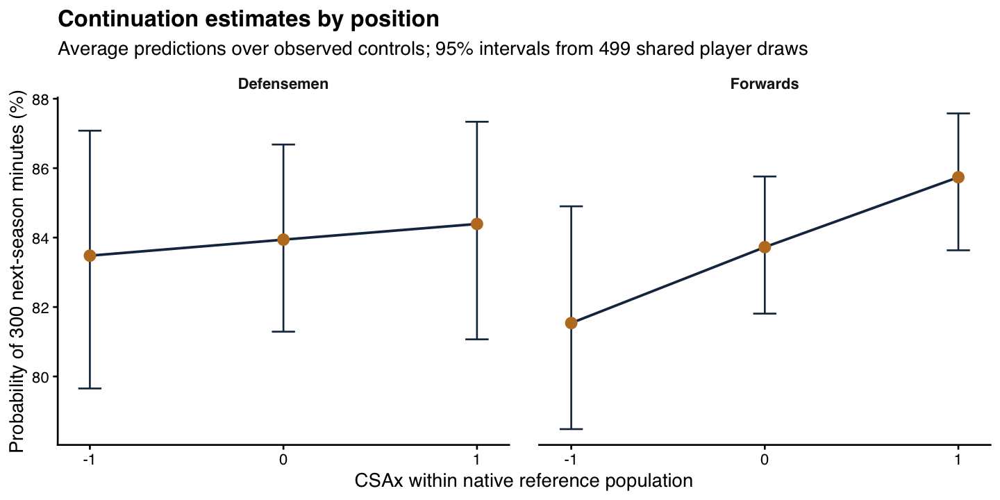

# Playing big across positions: CSAx_P research summary

A player can resemble a larger skater in several ways: by delivering contact, absorbing it, or repeatedly entering areas where possession is contested. We ask how much of that pattern the public record captures, how its meaning changes across positions, and whether it accompanies a sustained NHL role.

> **Playing big for one's size means showing a pattern of direct physical engagement and position-specific indirect behaviors associated with contested space that is more characteristic of a larger player than expected for one's listed height and weight.**

We distinguish direct engagement from indirect evidence of contested-space involvement. CSAx expresses behavior-predicted size above the prediction normally associated with a player's listed frame. Feature weights come from predicting listed size, so the score describes a learned behavioral pattern. It does not measure force, toughness, injury risk, or overall player value.

The extension uses separate forward and defenseman models. We also score centers against wing and defenseman reference populations that contain no centers. This comparison reveals how the same players look under different positional expectations.

## What the results show

The forward continuation association remains positive after accounting for current role: the odds ratio per CSAx standard deviation is **1.25 (1.02 to 1.48)**. The corresponding defenseman estimate is **1.05 (0.82 to 1.32)**. These are 95% percentile intervals from 499 full-pipeline player bootstrap samples. An odds ratio of 1 represents no conditional association; an odds ratio of 1.25 represents 25% higher odds, not a 25 percentage point increase in probability.

Centers show substantial rank agreement across the two reference models, while their reference-population percentiles can differ considerably. Much of that difference already appears when both models use only the shared direct variables. Meanwhile, the defenseman indirect proxies contribute little reliable size-prediction signal by themselves. These findings support further positional investigation while leaving defensive proxy validity open.

## Data and physicality measures

We study 2021–22 through 2024–25 behavior, followed by 2022–23 through 2025–26 outcomes. The eligible panel contains **1,763 forward-seasons from 613 players** and **968 defenseman-seasons from 343 players**, each with at least 300 regular-season minutes and available height, weight, and birth date. Centers contribute 855 seasons; wings contribute 908. Published player rankings require 500 minutes. Position labels and listed measurements come from the supplied player registry; these labels describe roster categories and may not capture every in-game assignment or historical change in body size.

| Component | Population | Measures and denominators |
| --- | --- | --- |
| Direct engagement | Both positions | Hits delivered, hits received, opponent shots blocked, fights, contact penalties taken, and contact penalties drawn, each per 60 minutes |
| Indirect contested-space behavior | Forwards and wing reference | Net-front unblocked attempts / located unblocked attempts; tips or deflections / typed shots on net; median distance of located unblocked attempts; backhands / typed shots on net |
| Exploratory defensive engagement | Defensemen and defensive reference | Defensive-zone takeaways per 60 minutes; perimeter defensive-zone takeaways / all defensive-zone takeaways |

An unblocked attempt is a goal, shot on goal, or missed shot. Shots on net comprise goals and shots on goal with a recorded shot type. We define the net-front region as normalized x from 82 to 89 feet and |y| at most 8 feet, with the attacking goal at x = 89. Distance is measured from that goal. Undefined shares remain missing until training-sample median imputation. Event numerators and denominators remain in the scientific inputs.

The contact-penalty whitelist includes boarding, charging, checking from behind, clipping, elbowing, illegal checks to the head, kneeing, roughing, slew-footing, cross-checking, high-sticking, holding, holding the stick, hooking, and tripping, including recorded helmet-removal and double-minor variants. Each recorded infraction counts once regardless of penalty minutes; fighting has its own variable. Generic interference, slashing, attempted-contact categories, and administrative infractions remain excluded. NHL rules permit some such penalties without confirmed contact, including slashing. Equipment contact and puck blocking still differ from a body check, so the direct component groups several forms of physical engagement. [NHL rulebook, 2023–24](https://media.nhl.com/site/asset/public/ext/2023-24/2023-24Rulebook.pdf), [NHL rulebook, 2025–26](https://media.nhl.com/site/asset/public/ext/2025-26/2025-26Rules.pdf).

For defensive proxies, we orient coordinates using the event owner's attacking direction and the recorded home defending end. The defensive zone is x < −25 feet. A defensive-zone takeaway occurs near the perimeter when |y| ≥ 32.5 feet or x ≤ −89 feet. We check actor-team assignments against game rosters. Teammate-blocked shots are excluded from the block count. Coordinate-derived zones take precedence over zone labels when they disagree.

In 2024–25, **745 of 12628 takeaways (5.90%)** have a zone label that differs from this coordinate definition. Some disagreements occur near zone boundaries; others place events at opposite ends. Total recorded takeaways fall from 18379 to 12628 between the final two seasons, a **31.29% decline**. We cannot attribute that change uniquely to behavior or recording practice.

Eligible defensemen have median defensive-zone takeaway counts of 12, 13, 11, and 8 across the four seasons; median perimeter counts are 6, 7, 6, and 5. Four defenseman-seasons have no defensive-zone takeaway, leaving their perimeter share undefined. A handful of events can therefore move the share markedly. Takeaways may reflect anticipation or stick skill without substantial contact. More detailed defensive-zone recovery measures demonstrate what richer observations can describe, but do not validate these public-event proxies. [Sportlogiq defensive recovery examples](https://www.sportlogiq.com/2020/08/05/elementor-2567/).

## Estimation and interpretation

Within each season and native reference population, we standardize height and weight, average their standardized values with equal weights, and standardize that combination to obtain listed size S. The fixed native population supplies this descriptive size reference. Centers receive wing-based S for the wing comparison and defenseman-based S for the defensive comparison; no center-specific size or score standardization is applied.

We fit ridge regression through tidymodels with one five-fold outer split and five inner folds. The inner search evaluates 20 penalties from 0.0001 to 100 by mean squared error. Training samples supply median imputation, zero-variance removal, Yeo–Johnson transformations, and predictor standardization. Each outer training sample also supplies a linear calibration of inner held-out predicted size on S. Thus neither feature preprocessing nor frame calibration uses an outer assessment player's behavior.

For each player, we obtain one outer assessment prediction xS and subtract the frame-specific expected prediction m(S). We then express this residual in units of the native reference population's held-out residual standard deviation:

$$
\mathrm{CSAx}_i = \frac{xS_i-m_{-k}(S_i)-\overline r_{\mathrm{ref}}}{s_{r,\mathrm{ref}}}.
$$

Here k identifies the player's assessment fold. Calibration addresses regression shrinkage: simply subtracting listed size from a weak size prediction would mechanically favor smaller players. We retain training-based calibration and inspect any remaining size gradient instead of assuming it disappears.

The main forward application trains on centers and wings together. The center comparison trains a separate forward specification on wings only and a defensive specification on defensemen only. Centers enter neither reference population. Each center is assigned to the same numbered assessment fold in both models and receives one prediction from each corresponding fit. Reference players also receive one excluded-sample prediction. This matches prediction procedures without averaging several predictions only for centers.

The score decomposes exactly into direct contribution, indirect contribution, and frame adjustment. For transformed and standardized features z, these terms are the direct weighted sum divided by residual SD, the indirect weighted sum divided by residual SD, and (ridge intercept − m(S) − mean native residual) divided by residual SD. The adjustment is part of the score. Coefficients describe conditional size prediction, not causal effects: a negative weight for hits received or penalties drawn means that, conditional on the other inputs, the action is more characteristic of smaller listed players in that reference sample. It does not mean less physical contact occurs.

## Model performance and components

| Season | Reference | N | RMSE | Mean-size RMSE | Predictive R-squared | CSAx-size correlation |
| --- | --- | --- | --- | --- | --- | --- |
| 2021–22 | Forwards | 451 | 0.94 | 1.00 | 0.11 | -0.02 |
| 2021–22 | Wings | 229 | 0.91 | 1.00 | 0.17 | -0.01 |
| 2021–22 | Defensemen | 241 | 0.90 | 1.01 | 0.20 | 0.02 |
| 2022–23 | Forwards | 446 | 0.94 | 1.00 | 0.12 | 0.01 |
| 2022–23 | Wings | 230 | 0.91 | 1.00 | 0.17 | 0.01 |
| 2022–23 | Defensemen | 233 | 0.96 | 1.00 | 0.08 | -0.01 |
| 2023–24 | Forwards | 438 | 0.93 | 1.00 | 0.13 | 0.00 |
| 2023–24 | Wings | 229 | 0.91 | 1.00 | 0.18 | -0.01 |
| 2023–24 | Defensemen | 250 | 0.91 | 1.00 | 0.17 | -0.01 |
| 2024–25 | Forwards | 428 | 0.93 | 1.00 | 0.13 | 0.01 |
| 2024–25 | Wings | 220 | 0.96 | 1.00 | 0.09 | -0.01 |
| 2024–25 | Defensemen | 244 | 0.97 | 1.00 | 0.06 | -0.04 |

Predictive R-squared compares held-out squared error with the outer-training mean-size baseline; it is distinct from squared prediction–outcome correlation. The combined positional models improve on that baseline in each season. Their CSAx–size correlations stay near zero. Adjacent-season CSAx correlations range from **0.74 to 0.77** for forwards and **0.56 to 0.65** for defensemen, among players eligible in consecutive seasons.

| Component | Feature | Forwards | Wings | Defensemen |
| --- | --- | --- | --- | --- |
| Direct | Hits delivered | 0.19 | 0.20 | 0.23 |
| Direct | Hits received | -0.07 | -0.02 | -0.08 |
| Direct | Blocked shots | 0.01 | -0.01 | 0.11 |
| Direct | Fights | 0.12 | 0.09 | 0.07 |
| Direct | Contact penalties taken | 0.09 | 0.10 | 0.05 |
| Direct | Contact penalties drawn | -0.08 | -0.09 | -0.13 |
| Indirect | Net-front attempt share | 0.05 | 0.05 | — |
| Indirect | Tip/deflection share | 0.04 | 0.06 | — |
| Indirect | Median shot distance | -0.05 | -0.01 | — |
| Indirect | Backhand share | 0.03 | 0.06 | — |
| Indirect | Defensive-zone takeaways | — | — | 0.08 |
| Indirect | Perimeter takeaway share | — | — | 0.02 |

Hits delivered have the largest median standardized coefficient in both main models. Blocks receive more weight among defensemen. The table includes the wing reference used to score centers; a dash marks a feature outside that specification. Median coefficients summarize 20 season-by-fold fits per reference population. They are descriptive summaries, not coefficient confidence intervals or a single universal scoring formula.

Direct-only and indirect-only reconstructions each relearn their own ridge weights and calibration. They ask how well each block can support a score on its own; the additive contributions above describe the blocks inside the combined model. The defenseman indirect-only model offers essentially no improvement over mean-size prediction. In 2022–23 its residual SD is about 0.01, and its standardized residual has a strong remaining size correlation, about 0.88. We treat that reconstruction as a failed standalone measure. Its downstream associations cannot establish defensive physicality validity.

## Centers under two positional expectations

Reference percentiles use the native held-out score distribution, with midranks for ties. A positive difference means higher relative standing among wings than among defensemen. A difference of 20 percentile points is a change in reference standing; it is not 20 units of physicality.

| Season | Centers | Spearman correlation (95% CI) | Mean wing-minus-defenseman percentile (95% CI) |
| --- | --- | --- | --- |
| 2021–22 | 222 | 0.74 (0.41 to 0.79) | 22.89 (2.94 to 32.28) |
| 2022–23 | 216 | 0.71 (0.25 to 0.79) | 28.24 (11.05 to 37.89) |
| 2023–24 | 209 | 0.71 (0.40 to 0.80) | 25.62 (14.51 to 36.80) |
| 2024–25 | 208 | 0.66 (0.24 to 0.74) | 8.12 (-8.45 to 26.63) |

For each center we flag any height, weight, or modeled feature beyond its assigned outer training sample's observed range. The supported subset also requires no imputed feature under either model. These marginal range checks cannot guarantee support for every multivariate combination. The supported subset yields:

| Season | Centers | Mean percentile difference (95% CI) |
| --- | --- | --- |
| 2021–22 | 105 | 18.43 (-1.93 to 31.13) |
| 2022–23 | 150 | 29.50 (9.85 to 39.98) |
| 2023–24 | 120 | 26.32 (12.89 to 40.20) |
| 2024–25 | 92 | -1.50 (-13.72 to 24.05) |

The shared direct variables already produce center rank correlations from **0.76 to 0.88**. Their mean percentile differences are 20.25, 25.01, 27.16, 3.22 points in season order. Consequently, positional weights and reference distributions explain much of the divergence before we add distinct indirect measures. In the combined defensive reference, centers' average direct contribution changes from -1.41 in 2023–24 to -0.40 in 2024–25; their indirect contribution changes from -0.10 to -0.14. Each season has its own reference scale, but this decomposition locates most of the numerical shift in the direct block. The smaller final-season percentile gap also coincides with the decline in recorded takeaways. That timing motivates closer review without establishing why the gap changes.

The following 2024–25 examples all meet the 500-minute ranking threshold. They illustrate observed differences and range support, without individual rank confidence intervals:

| Player | Wing percentile | Defenseman percentile | Difference | Support |
| --- | --- | --- | --- | --- |
| Sidney Crosby | 84.09 | 12.70 | 71.39 | Outside defenseman block-rate range |
| Aleksander Barkov | 25.91 | 48.36 | -22.45 | Within observed ranges |
| Alex Turcotte | 89.09 | 7.38 | 81.71 | Outside defenseman block-rate range |
| Jason Dickinson | 17.73 | 83.20 | -65.47 | Within observed ranges |

## NHL continuation and other applications

Continuation means at least 300 minutes in the following regular season. We observe 1,486 continuations among forward-seasons and 813 among defenseman-seasons. Logistic models control for listed size, age and age squared, current games dressed and ice time per game, five-on-five points per 60, relative shot-attempt share, and season. Supporting outcomes preserve the same core controls.

| Position | Continuation odds ratio (95% CI) | Difference, +1 versus -1 CSAx (percentage points) |
| --- | --- | --- |
| Defensemen | 1.05 (0.82 to 1.32) | 0.91 (-3.73 to 5.32) |
| Forwards | 1.25 (1.02 to 1.48) | 4.20 (0.31 to 7.26) |

Average predictions hold each observation's controls at its observed values and set CSAx to −1 or +1. Their difference translates the odds ratio into a probability contrast for this sample. These estimates describe associations among comparable observed roles; they do not estimate what would happen if a player changed behavior.

Conditioning matters. The unadjusted forward continuation odds ratio is 0.74, while the fully adjusted estimate is 1.25. Physical profiles and existing roles overlap. Among forwards with a prior NHL appearance, the current-role estimate is 1.25 (1.06 to 1.47) and the prior-role estimate is 1.21 (1.02 to 1.44). Prior-role comparisons condition on earlier games and ice time while retaining current production controls. Conditioning can also select on consequences of earlier performance, health, and coaching decisions.

Career stage counts completed prior NHL seasons, including seasons below the current eligibility threshold. Pooled interaction models yield:

| Position | Prior NHL seasons | Odds ratio (95% CI) |
| --- | --- | --- |
| Defensemen | 0-2 prior seasons | 0.86 (0.56 to 1.32) |
| Defensemen | 3-6 prior seasons | 1.13 (0.84 to 1.53) |
| Defensemen | 7+ prior seasons | 1.19 (0.86 to 1.64) |
| Forwards | 0-2 prior seasons | 0.85 (0.66 to 1.10) |
| Forwards | 3-6 prior seasons | 1.33 (1.03 to 1.73) |
| Forwards | 7+ prior seasons | 1.60 (1.26 to 2.03) |

The joint career-stage interaction p-values are 0.001 for forwards and 0.482 for defensemen. These conditional analyses suggest a stronger forward association later in a career, without establishing a developmental trajectory or causal survival mechanism. Listed-size and ice-time interaction estimates appear in the application CSV.

| Position | Outcome | N | Effect per CSAx SD (95% CI) | Units |
| --- | --- | --- | --- | --- |
| Defensemen | Any next-season appearance | 968 | 1.01 (0.78 to 1.31) | Odds ratio |
| Defensemen | Next-season games dressed | 968 | 0.99 (-0.56 to 2.53) | Games |
| Defensemen | Next-season TOI per game among returners | 897 | -0.15 (-0.29 to -0.02) | Minutes |
| Forwards | Any next-season appearance | 1763 | 1.51 (1.22 to 1.88) | Odds ratio |
| Forwards | Next-season games dressed | 1763 | 2.03 (0.86 to 3.20) | Games |
| Forwards | Next-season TOI per game among returners | 1624 | -0.14 (-0.22 to -0.06) | Minutes |
| Defensemen | External-contract duration | 105 | 0.10 (-0.14 to 0.34) | Years |
| Defensemen | Cap-adjusted contract AAV | 105 | 3.67 (-5.57 to 13.82) | Percent |
| Forwards | External-contract duration | 183 | 0.32 (0.08 to 0.56) | Years |
| Forwards | Cap-adjusted contract AAV | 183 | 6.81 (-1.18 to 15.46) | Percent |
| Defensemen | Playoff dressing share | 480 | 2.11 (-0.49 to 4.71) | Percentage points |
| Defensemen | Playoff minutes per team game | 480 | 0.40 (-0.06 to 0.85) | Minutes |
| Forwards | Playoff dressing share | 897 | 3.34 (1.26 to 5.43) | Percentage points |
| Forwards | Playoff minutes per team game | 897 | 0.37 (0.06 to 0.68) | Minutes |

External contracts include veteran signings at age 27 or older with another team, usable prior contract terms, and an eligible prior-season score. We exclude known announcements at or before the prior regular-season end. Models include prior AAV and duration, signing age, prior playing role and production, size, and signing season. We model log(AAV / salary cap) and report the association as a percentage difference. There are 183 forward contracts and 105 defenseman contracts. Unmatched announcement dates remain a timing limitation.

Playoff dressing share divides games dressed by the final regular-season team's playoff games. Playoff minutes also use team games, assigning zero to eligible players who do not dress. Next-season minutes per game are conditional on returning, whereas games dressed include zero for non-returners. These distinct denominators answer different questions and help explain why continued participation need not coincide with higher minutes among those who return.

Supporting intervals use player-clustered HC1 covariance and condition on estimated CSAx. They do not carry the full score-estimation uncertainty. The number of exploratory outcomes also warrants restraint when interpreting isolated intervals that exclude zero.

## Team patterns and scouting evidence

We weight eligible players' CSAx by games dressed for each team, using separate forward and defenseman aggregates. Centers appear once in the forward group. Team goals above expected are observed goals minus supplied expected goals, standardized within season for descriptive correlations. The playoff comparison relates 2024–25 team CSAx to the absolute change in five-on-five xG per unblocked attempt from regular season to playoffs.

| Position | Team-seasons | GAx correlation | Playoff quality-change correlation | Median coverage (%) | Minimum coverage (%) |
| --- | --- | --- | --- | --- | --- |
| Defensemen | 128 | -0.03 | -0.07 | 96.08 | 83.33 |
| Forwards | 128 | -0.17 | -0.37 | 94.77 | 86.27 |

Each position contributes 128 team-seasons to the regular-season comparison and 16 teams to the latest playoff comparison. Eligible-player coverage is reported against all games dressed in that position group. These are descriptive team patterns, with small playoff samples and no claim that increasing a team's CSAx improves finishing or preserves shot quality.

We retain the 40 frozen forward scouting ratings and recompute associations with player-average forward CSAx. The ordinal physicality rating has Spearman correlation **0.47** with mean CSAx, and a one-category increase corresponds to **0.38 (0.15 to 0.61)** CSAx units. Active-engagement language has association 0.59 (0.16 to 1.02); interior-play language has association 0.10 (-0.34 to 0.54). Explicit plays-bigger language corresponds to 0.90 (0.15 to 1.65), although only two reports use that language. The three binary-cue Holm-adjusted p-values are 0.020, 0.660, and 0.038, respectively. All ratings come from one rater and a selected draft-report cohort. Draft-era prose and later NHL behavior are separated in time. This modest external check applies to forwards; defenseman scouting validation remains deferred.

## Focused sensitivity analyses

| Position | Specification | Continuation odds ratio (conditional 95% CI) |
| --- | --- | --- |
| Defensemen | Direct only | 1.00 (0.81 to 1.22) |
| Forwards | Direct only | 1.24 (1.07 to 1.44) |
| Defensemen | Indirect only | 1.08 (0.89 to 1.29) |
| Forwards | Indirect only | 1.08 (0.92 to 1.27) |
| Forwards | Rebound addition | 1.24 (1.07 to 1.44) |
| Defensemen | 500 minutes | 1.09 (0.90 to 1.32) |
| Forwards | 500 minutes | 1.41 (1.14 to 1.73) |
| Defensemen | Away games | 1.01 (0.83 to 1.21) |
| Forwards | Away games | 1.29 (1.11 to 1.49) |
| Defensemen | Five on five | 1.06 (0.87 to 1.29) |
| Forwards | Five on five | 1.25 (1.07 to 1.46) |

These analyses comprise component reconstructions, one forward rebound-share addition, 500-minute eligibility, away-game recording, and five-on-five opportunity. Rebound share uses same-team follow-up unblocked attempts within the package's three-second event-sequence rule, divided by unblocked attempts. It represents an inferred shooting sequence, not an observed recovery under pressure. Away and five-on-five reconstructions match event numerators to shift-derived exposure; total regular-season minutes still determine eligibility except in the 500-minute restriction. Shift and official time totals differ slightly: two player-seasons have shift-derived five-on-five exposure exceeding official total time by 113 and 219 seconds. Those source differences limit the precision of the opportunity sensitivity. The higher-minute specification relearns reference scales and scores on its smaller cohort.

We use the same five-fold design and tuning grid for these reconstructions. Their application intervals remain conditional on scores, and the defenseman indirect-only failure described above limits interpretation of that row. We do not use these alternatives to select the primary specification or run separate bootstrap campaigns for them.

## Uncertainty and limits

One shared set of 499 player bootstrap draws underlies the primary continuation and center-agreement intervals. Every draw samples complete player histories with replacement across the eligible panel and refits native size references, nested feature preprocessing and tuning, training-based calibration, residual scales, scores, and continuation models. Duplicate copies of an original player remain together in outer and inner folds. The same draw supplies both positional applications and both center reference scores. Center summary intervals preserve pairing; the range-supported subset is recalculated within each draw.

The bootstrap conditions on the observed seasons and source records. It does not quantify uncertainty from event misclassification, static listed measurements, positional labeling, an unobserved season, or the definition of physical engagement itself. Rink recording and role exposure remain possible influences even after the focused opportunity checks. Marginal range flags identify obvious extrapolation, but observational associations and good size prediction cannot establish that every component measures the intended construct.

## Research roadmap toward Sloan

1. **Resolve defensive construct validity first.** Review a small, prespecified set of defensive-zone takeaway clips spanning high and low perimeter shares, season, and rink. Record whether pressure, body contact, or puck protection is visible, using coding independent of CSAx and outcomes. This is a proposed next study, not completed defenseman scouting validation. If these events mainly reflect stick skill or recording practice, seek observations of contested recoveries and possession retention before expanding claims about defensive physicality.
2. **Explain the positional bridge.** Follow matched center examples through the direct contributions, indirect contributions, and frame adjustment. Prioritize the strong direct-only differences and the smaller 2024–25 mean gap. Document how positional expectations and sparse events combine, while keeping each reference scale intact.
3. **Build the central empirical story around role and continuation.** The forward application extends naturally from the original study; the defensive application tests its reach. Keep contract, playoff, and team results as supporting evidence. Use the probability contrast to explain practical scale and retain the uncertainty around defensive estimates.
4. **Prepare the submission from completed results.** Sloan lists October 1, 2026 at 11:59 p.m. Eastern for abstracts and December 4, 2026 at 11:59 p.m. Eastern for invited full papers. Abstracts must contain fewer than 500 words including title and body, and report actual results. Current guidance also requires an open-source repository link. The repository remains private; public release is a subsequent visibility decision, with the included data and third-party terms reviewed before release. [Sloan research competition guidance](https://www.sloansportsconference.com/research-paper-competition).

## Reproducible results

The repository contains one compact analysis object, `data/analysis_data.rds`, including frozen inputs, source hashes, model summaries, application estimates, and all 499 bootstrap summaries. The numbered R workflow restores the input snapshot, fits models, analyzes applications, and regenerates this report. Locked scouting codes remain separate from derived CSAx summaries. Private scouting prose and local caches stay outside Git.

The accompanying files are [player rankings](player_rankings.csv), [paired center comparisons](center_comparisons.csv), [center agreement intervals](center_agreement.csv), [team summaries](team_summaries.csv), and [application estimates](application_estimates.csv). The five highest 2024–25 scores in each native position group illustrate the additive decomposition:

| Position | Rank | Player | CSAx | Direct contribution | Indirect contribution | Frame adjustment |
| --- | --- | --- | --- | --- | --- | --- |
| Defensemen | 1 | Tyler Tucker | 3.65 | 3.03 | 0.45 | 0.17 |
| Defensemen | 2 | Nick Seeler | 3.05 | 2.93 | 0.04 | 0.08 |
| Defensemen | 3 | Connor Clifton | 2.81 | 1.74 | 0.57 | 0.50 |
| Defensemen | 4 | MacKenzie Weegar | 2.60 | 1.88 | 0.41 | 0.31 |
| Defensemen | 5 | Jayden Struble | 2.02 | 1.37 | 0.51 | 0.14 |
| Forwards | 1 | Mathieu Olivier | 4.16 | 3.43 | 1.26 | -0.53 |
| Forwards | 2 | Ryan Lomberg | 3.30 | 2.70 | 0.07 | 0.52 |
| Forwards | 3 | Tanner Jeannot | 2.81 | 2.28 | 0.83 | -0.30 |
| Forwards | 4 | Mark Kastelic | 2.65 | 3.37 | 0.10 | -0.82 |
| Forwards | 5 | Marcus Foligno | 2.42 | 2.19 | 0.90 | -0.66 |

Small discrepancies in sums can arise from rounding displayed contributions. Scores and rankings retain their own positional reference, and high values describe size-associated behavior beyond frame expectation.