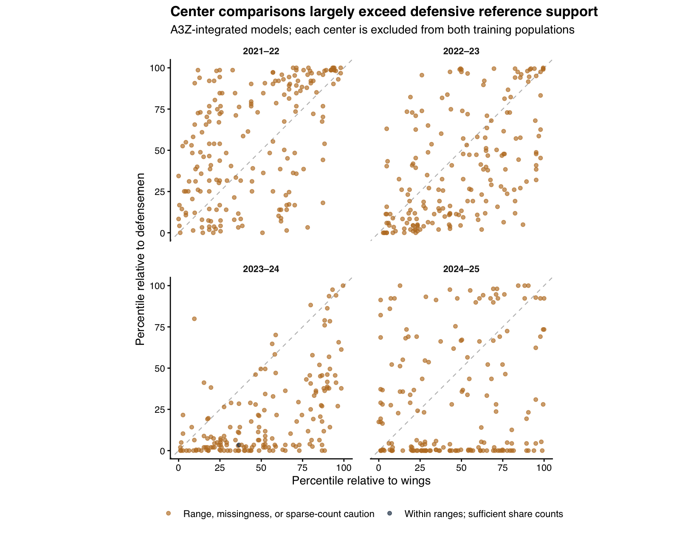

# Playing bigger through contact and puck play

A defenseman who retrieves a dump-in and starts a breakout contributes something that a hit count can miss. We bring those puck plays into CSAx alongside physical contact and examine what the resulting score actually measures.

> **Playing bigger than your size means making your presence felt in battles for the puck and space beyond what your size would suggest.**

We distinguish involvement in physical contests from effective puck play under pressure. CSAx captures a statistical pattern within that broader idea: we predict listed height-and-weight size from behavior, then measure how far the prediction exceeds the expectation associated with the listed frame. Higher CSAx describes behavior associated with larger players. Its weights are learned from size prediction, so they do not necessarily reward successful execution.

## What the models show

The A3Z-integrated models use **1,485 forward-seasons and 829 defenseman-seasons**. Compared with play-by-play models fitted on identical players and games, pooled predictive R² rises from **7.54% to 9.53% for defensemen** and changes from **8.73% to 8.58% for forwards**. The forward difference offers no predictive gain. Defensive performance varies substantially by season: the 2024–25 model reduces squared prediction error relative to the training-mean baseline by only **0.25%**, with a remaining CSAx–size correlation of **-0.10**.

The learned weights expose an important conceptual limitation. Defensemen receive a positive median weight for botched retrievals and a negative weight for the possession share of successful exits. These are conditional associations with listed size. They cannot support interpreting higher CSAx as uniformly better puck play under pressure. A3Z expands what we observe, while the size-prediction target continues to determine what the score rewards.

The center comparison has a separate limitation. Across **724 center-seasons**, only **12** remain within both training ranges with complete inputs, and only **1** also has at least 20 opportunities for each modeled share. Thus the positional comparison is predominantly extrapolation. We describe its behavior without treating it as a supported ranking of centers against defensemen.

## Data, coverage, and opportunity

We use the freely downloadable [A3Z transition workbook](https://public.tableau.com/app/profile/corey.sznajder/viz/transitionstats/Sheet1), linked from the [official A3Z website](https://www.allthreezones.com/links.html). The extract collected on September 15, 2026 includes game-level microstats for all four behavior seasons. We retain regular-season observations from 2021–22 through 2024–25 and preserve the existing next-season outcome definitions through 2025–26.

| Season | Retained NHL games | Teams | Tracked games per team | Median absolute time difference (seconds) |
| --- | --- | --- | --- | --- |
| 2021–22 | 491 | 32 | 20 to 41 | 12.00 |
| 2022–23 | 414 | 32 | 20 to 32 | 11.00 |
| 2023–24 | 390 | 32 | 17 to 38 | 11.00 |
| 2024–25 | 383 | 32 | 16 to 41 | 10.00 |

Eligibility requires 300 full-season NHL minutes and 150 matched five-on-five minutes. Published rankings additionally require 500 full-season minutes. NHL shift-derived time supplies the common denominator for NHL and A3Z count rates. Event numerators cover the same retained player-games; untracked observations are never filled with zero.

| Season | Position | Full-season eligible | Pilot eligible | Retained (%) | Median tracked games | Median tracked minutes |
| --- | --- | --- | --- | --- | --- | --- |
| 2021–22 | Defensemen | 241 | 215 | 89.21 | 25 | 417.50 |
| 2021–22 | Forwards | 451 | 399 | 88.47 | 27 | 317.38 |
| 2022–23 | Defensemen | 233 | 203 | 87.12 | 23 | 364.97 |
| 2022–23 | Forwards | 446 | 374 | 83.86 | 23 | 284.17 |
| 2023–24 | Defensemen | 250 | 204 | 81.60 | 21 | 334.26 |
| 2023–24 | Forwards | 438 | 359 | 81.96 | 23 | 267.77 |
| 2024–25 | Defensemen | 244 | 207 | 84.84 | 19 | 310.78 |
| 2024–25 | Forwards | 428 | 353 | 82.48 | 21 | 266.25 |

The tracked sample retains **84.73%** of the full-season eligible panel. Tracking covers every team but follows an uneven selection of games. Included skaters also have substantially greater full-season playing time. The pilot therefore represents a more established group, and its associations need not extend to players with limited NHL exposure.

| Position | Sample | Player-seasons | Mean height (in) | Mean weight (lb) | Median full-season minutes |
| --- | --- | --- | --- | --- | --- |
| Defensemen | Outside tracked-minute sample | 139 | 73.83 | 202.24 | 489.50 |
| Defensemen | Included | 829 | 73.96 | 205.52 | 1384.10 |
| Forwards | Outside tracked-minute sample | 278 | 73.01 | 199.90 | 460.43 |
| Forwards | Included | 1485 | 72.98 | 199.51 | 1156.78 |

We match source labels to NHL schedules and game rosters. Exact names take precedence over sweater numbers; roster names, surnames, and numbers resolve aliases and distinguish players with shared names, including both Sebastian Ahos and both Elias Petterssons. A nearby date is accepted only when a unique candidate within three days has at least 90% roster agreement. Ambiguous games remain excluded. Two December 14, 2024 labels contain opposite teams from the same Chicago–New Jersey game; their distinct player rows share one NHL game identifier. We collapse identical player-game duplicates and exclude conflicting copies. Original labels, match decisions, and row dispositions are retained in the analysis object.

We calculate time from the union of overlapping NHL shift intervals, preventing duplicate records from multiplying exposure. A player-game is excluded when its A3Z and NHL totals differ by more than 120 seconds; a game is excluded when the median absolute difference exceeds 60 seconds. These are source-consistency filters set before model fitting. They do not establish that every manually tracked event is complete or correctly classified.

| Disposition | Player-game rows |
| --- | --- |
| Game exposure disagreement | 180 |
| Invalid event counts | 6 |
| Player exposure disagreement | 40 |
| Retained | 60331 |
| Unresolved game | 540 |
| Unresolved player | 1 |

## Direct engagement and positional indirect measures

Both positions use hits delivered, hits received, opponent shots blocked, fights, contact penalties taken, and contact penalties drawn per 60 matched five-on-five minutes. Contact penalties follow the existing whitelist: boarding, charging, checking from behind, clipping, elbowing, illegal head checks, kneeing, roughing, slew-footing, cross-checking, high-sticking, holding, holding the stick, hooking, and tripping, including recorded helmet-removal and double-minor variants. We count infractions; fighting has its own variable. Generic interference, slashing, attempted-contact categories, and administrative penalties remain excluded. Event-team attribution agrees with game rosters for the checked contact measures.

Forwards retain net-front unblocked-attempt share, tip/deflection share, median unblocked-shot distance, and backhand share. Net-front attempts lie between normalized x = 82 and 89 feet with |y| ≤ 8 feet; the denominator is all located unblocked attempts. Tips, deflections, and backhands use typed shots on net. The added A3Z measures are:

| Population | Measure | Calculation |
| --- | --- | --- |
| Forwards and wing reference | Dump-in recoveries | Recorded recoveries per 60 |
| Forwards and wing reference | Forecheck pressures | Recorded pressures per 60 |
| Forwards and wing reference | Forecheck/cycle shot assists | Recorded forecheck assists plus cycle assists, per 60 |
| Defensemen | Retrievals leading to exits | Recorded count per 60 |
| Defensemen | Botched retrievals | Recorded count per 60 |
| Defensemen | Possession exit share | Exits with possession / recorded successful exits |
| Defensemen | Entry denial share | Denials / targeted entries |

A3Z credits dump-in recoveries when a subsequent play follows recovery, and its exit tracking focuses on resistance from a forecheck. The possession-exit share describes how successful exits occur; failed exits are outside its denominator. Botched retrievals remain a rate because the failure categories do not provide an interchangeable set of attempt denominators. Forecheck/cycle assists can reflect skill and offensive role without establishing physical contact. [A3Z glossary](https://www.allthreezones.com/player-cardsfaq.html), [retrieval methodology](https://allthreezones.substack.com/p/catch-and-retrieve).

For defensemen, these four features replace the takeaway-location proxies. The matched play-by-play comparator retains those proxies and uses the same five-on-five observations. All undefined shares remain missing until training-sample imputation. Counts and denominators remain available alongside scores.

| Position | Median successful exits | Median targeted entries | Median retrievals leading to exits | Median dump-in recoveries |
| --- | --- | --- | --- | --- |
| Centers | 39.00 | 10.00 | 23.00 | 12.00 |
| Defensemen | 53.00 | 137.00 | 55.00 | 0.00 |
| Wings | 39.00 | 8.00 | 21.00 | 13.00 |

## Estimation and held-out performance

We fit separate seasonal ridge models for all forwards, wings, and defensemen. Each system uses five outer folds and five inner tuning folds over the same 20 penalties from 0.0001 to 100. Training samples supply median imputation, zero-variance removal, Yeo–Johnson transformations, and normalization. Within each outer training sample, inner held-out predictions supply the linear frame calibration. Each reference player receives one excluded-sample prediction.

Listed size is the standardized combination of listed height and weight within the native season and reference population. CSAx is the calibrated prediction residual standardized against native held-out residuals. The A3Z and matched play-by-play models share players, games, folds, preprocessing procedures, and listed-size references; their fitted preprocessing parameters and residual scales belong to their respective specifications. Predictive R² compares held-out squared error with prediction by the outer-training mean. The pooled values below combine squared errors across seasons.

| Specification | Reference | Player-seasons | RMSE | Predictive R² (%) |
| --- | --- | --- | --- | --- |
| A3Z integrated | Defensemen | 829 | 0.95 | 9.53 |
| A3Z integrated | Forwards | 1485 | 0.96 | 8.58 |
| A3Z integrated | Wings | 761 | 0.93 | 14.69 |
| Matched play-by-play | Defensemen | 829 | 0.96 | 7.54 |
| Matched play-by-play | Forwards | 1485 | 0.96 | 8.73 |
| Matched play-by-play | Wings | 761 | 0.93 | 14.15 |

| Season | Reference | A3Z R² (%) | Matched PBP R² (%) | A3Z CSAx–size correlation | PBP CSAx–size correlation |
| --- | --- | --- | --- | --- | --- |
| 2021–22 | Forwards | 12.47 | 11.47 | 0.02 | 0.02 |
| 2021–22 | Wings | 20.00 | 16.05 | 0.05 | 0.05 |
| 2021–22 | Defensemen | 13.83 | 15.93 | -0.01 | 0.01 |
| 2022–23 | Forwards | 8.57 | 8.71 | 0.01 | 0.00 |
| 2022–23 | Wings | 15.28 | 14.81 | 0.04 | 0.06 |
| 2022–23 | Defensemen | 10.11 | 6.38 | 0.00 | -0.03 |
| 2023–24 | Forwards | 5.81 | 6.50 | -0.03 | -0.01 |
| 2023–24 | Wings | 8.67 | 8.92 | 0.01 | 0.01 |
| 2023–24 | Defensemen | 13.83 | 9.17 | 0.04 | 0.03 |
| 2024–25 | Forwards | 7.00 | 7.92 | -0.01 | 0.02 |
| 2024–25 | Wings | 14.27 | 16.75 | 0.03 | 0.05 |
| 2024–25 | Defensemen | 0.25 | -1.67 | -0.10 | -0.09 |

Direct and indirect reconstructions relearn weights and calibration using their respective feature blocks. The forward A3Z-only reconstruction uses the three microstats without shooting features. These comparisons assess information in each block; they do not establish that the blocks measure the same construct.

| Specification | Reference | Predictive R² (%) | Seasons above mean baseline |
| --- | --- | --- | --- |
| A3Z only | Forwards | 1.83 | 2 of 4 |
| A3Z only | Wings | 5.61 | 3 of 4 |
| Direct only | Defensemen | 8.41 | 3 of 4 |
| Direct only | Forwards | 8.99 | 4 of 4 |
| Direct only | Wings | 14.03 | 4 of 4 |
| Indirect only | Defensemen | 0.97 | 1 of 4 |
| Indirect only | Forwards | 1.82 | 3 of 4 |
| Indirect only | Wings | 5.51 | 3 of 4 |

Annual stability is lower for the A3Z-integrated scores than for the matched play-by-play scores across the forward and defenseman comparisons. The available game samples and changing fitted relationships both contribute potential uncertainty.

| Specification | Reference | Annual Pearson range | Annual Spearman range |
| --- | --- | --- | --- |
| A3Z integrated | Defensemen | 0.47 to 0.49 | 0.45 to 0.50 |
| A3Z integrated | Forwards | 0.59 to 0.61 | 0.56 to 0.61 |
| A3Z integrated | Wings | 0.57 to 0.66 | 0.55 to 0.62 |
| Matched play-by-play | Defensemen | 0.53 to 0.59 | 0.56 to 0.61 |
| Matched play-by-play | Forwards | 0.63 to 0.65 | 0.60 to 0.65 |
| Matched play-by-play | Wings | 0.57 to 0.70 | 0.58 to 0.68 |

## What influences CSAx

Hits delivered retain the largest median standardized weight in both main positional models. Dump-in recoveries receive a positive forward weight, whereas forecheck pressure and forecheck/cycle shot assists have small negative medians. Among defensemen, retrievals leading to exits and entry denials contribute alongside botched retrievals and possession-exit share.

| Component | Measure | Defensemen | Forwards | Wings |
| --- | --- | --- | --- | --- |
| Direct | Hits delivered | 0.19 | 0.18 | 0.18 |
| Direct | Hits received | -0.07 | -0.05 | -0.01 |
| Direct | Blocked shots | 0.02 | 0.04 | 0.02 |
| Direct | Fights | 0.06 | 0.05 | 0.05 |
| Direct | Contact penalties taken | 0.06 | 0.07 | 0.05 |
| Direct | Contact penalties drawn | -0.07 | -0.03 | -0.03 |
| Indirect | Net-front attempt share | — | 0.02 | 0.05 |
| Indirect | Tip/deflection share | — | 0.01 | 0.03 |
| Indirect | Median shot distance | — | -0.03 | 0.03 |
| Indirect | Backhand share | — | 0.01 | 0.04 |
| Indirect | Dump-in recoveries | — | 0.08 | 0.09 |
| Indirect | Forecheck pressures | — | -0.02 | -0.01 |
| Indirect | Forecheck/cycle shot assists | — | -0.03 | -0.06 |
| Indirect | Retrievals leading to exits | 0.08 | — | — |
| Indirect | Botched retrievals | 0.09 | — | — |
| Indirect | Possession share of successful exits | -0.08 | — | — |
| Indirect | Entry denial share | 0.08 | — | — |

Each coefficient summarizes transformed, standardized predictors and conditional size prediction. Botched retrievals receive positive weights despite recording unsuccessful execution, while possession-preserving exits receive negative weights in most fits. These directions can reflect differences in physical style and role. They leave higher CSAx without a uniform interpretation as more effective puck play.

For individual scores, we retain the exact decomposition into direct contribution, indirect contribution, and frame-calibration adjustment. The three terms sum to CSAx. The coefficient table reports medians across fits, so it is not a single scoring formula.

The following 2024–25 examples are selected by the largest absolute percentile changes among ranking-eligible skaters. Percentile changes describe relative standing within each positional sample. They are especially uncertain for defensemen because that season has weak size prediction and a remaining size gradient.

| Position | Player | Tracked games | Play-by-play percentile | A3Z percentile | Difference (points) |
| --- | --- | --- | --- | --- | --- |
| Defensemen | John Carlson | 25 | 7.00 | 82.37 | 75.36 |
| Defensemen | Esa Lindell | 31 | 18.60 | 89.61 | 71.01 |
| Defensemen | William Borgen | 31 | 83.33 | 13.77 | -69.57 |
| Defensemen | Vince Dunn | 16 | 28.74 | 95.89 | 67.15 |
| Forwards | Tye Kartye | 26 | 38.67 | 77.76 | 39.09 |
| Forwards | Oskar Bäck | 27 | 40.65 | 76.91 | 36.26 |
| Forwards | Corey Perry | 20 | 64.73 | 28.75 | -35.98 |
| Forwards | Dmitri Voronkov | 16 | 87.96 | 57.08 | -30.88 |

For the largest upward and downward moves in each position, the following decomposition shows how the fitted feature weights and frame adjustment combine. Contributions are in units of the corresponding reference score and sum to CSAx before rounding. Comparing the direct terms also reveals that adding indirect measures can change the weights and scaling of the shared contact variables.

| Player | Specification | Direct | Indirect | Frame adjustment | CSAx |
| --- | --- | --- | --- | --- | --- |
| John Carlson | A3Z integrated | -0.46 | 1.48 | -0.29 | 0.73 |
| John Carlson | Matched play-by-play | -1.15 | -0.16 | -0.13 | -1.43 |
| William Borgen | A3Z integrated | 0.00 | -1.03 | -0.01 | -1.04 |
| William Borgen | Matched play-by-play | 0.10 | 0.58 | 0.06 | 0.74 |
| Corey Perry | A3Z integrated | -0.48 | 0.15 | -0.26 | -0.59 |
| Corey Perry | Matched play-by-play | -0.37 | 1.00 | -0.27 | 0.36 |
| Tye Kartye | A3Z integrated | 0.23 | 0.33 | 0.17 | 0.73 |
| Tye Kartye | Matched play-by-play | 0.37 | -0.79 | 0.16 | -0.27 |

## Centers across positional references

We train the forward feature specification on wings and the defensive specification on defensemen, excluding centers from both populations. Each center receives one prediction from matched assessment-fold fits. Reference populations supply size and residual scales; centers are never standardized separately.

| Season | Centers | Spearman | Mean wing-minus-defenseman percentile | Within ranges and complete | Also ≥20 share opportunities |
| --- | --- | --- | --- | --- | --- |
| 2021–22 | 194 | 0.50 | -10.59 | 3 | 0 |
| 2022–23 | 186 | 0.57 | 9.41 | 3 | 0 |
| 2023–24 | 170 | 0.57 | 31.05 | 5 | 1 |
| 2024–25 | 174 | 0.13 | 14.25 | 1 | 0 |

Center profiles often lie beyond the defensive training ranges: 638 have an entry denial share outside the corresponding defenseman range, and 545 have an out-of-range botched-retrieval rate. Most also have few targeted entries. The 20-opportunity flag is a descriptive caution, not a claim that 20 observations establish reliability. The scarcity of supported center comparisons prevents a firm interpretation of differences as positional consistency in playing bigger. Percentiles describe relative standing under separate models, not physicality on a common scale.

Shared-direct reconstructions show how much difference exists before position-specific indirect features enter:

| Season | Spearman | Mean wing-minus-defenseman percentile |
| --- | --- | --- |
| 2021–22 | 0.92 | 1.83 |
| 2022–23 | 0.90 | -2.47 |
| 2023–24 | 0.81 | 9.25 |
| 2024–25 | 0.45 | -5.81 |

The following center examples illustrate the overlap problem in 2024–25. Their percentiles remain descriptive outputs of the reference models, with the defensive opportunity counts shown alongside them.

| Player | Wing percentile | Defenseman percentile | Targeted entries | Within ranges and complete |
| --- | --- | --- | --- | --- |
| Aleksander Barkov | 34.64 | 5.80 | 11 | No |
| Jack Hughes | 26.26 | 0.00 | 6 | No |
| Sidney Crosby | 30.17 | 53.62 | 4 | No |

## Scouting and next-season continuation

We retain all 40 frozen forward scouting ratings, with eligible pilot scores available for 39 rated players. Associations use their available seasonal means and the same observed players under both specifications. Overall-physicality Spearman correlation is **0.50** for the A3Z-integrated score and **0.56** for the matched play-by-play score. Interior-play associations remain weak. These ratings evaluate forward physical style and do not supply independent validation of defensive pressure-handling skill.

| Specification | Indicator | Players | Spearman |
| --- | --- | --- | --- |
| A3Z integrated | Overall physicality | 39 | 0.50 |
| A3Z integrated | Explicitly plays bigger | 39 | 0.37 |
| A3Z integrated | Active physical engagement | 39 | 0.51 |
| A3Z integrated | Interior play | 39 | 0.16 |
| Matched play-by-play | Overall physicality | 39 | 0.56 |
| Matched play-by-play | Explicitly plays bigger | 39 | 0.36 |
| Matched play-by-play | Active physical engagement | 39 | 0.56 |
| Matched play-by-play | Interior play | 39 | 0.15 |

Continuation means at least 300 NHL minutes in the following season. We retain listed size, age and age squared, games dressed, ice time per game, five-on-five scoring rate, relative shot attempts, and season controls. The comparison uses identical player-seasons under both specifications.

| Specification | Position | Player-seasons | Continuation odds ratio (95% CI) |
| --- | --- | --- | --- |
| A3Z integrated | Defensemen | 829 | 1.40 (1.06 to 1.84) |
| A3Z integrated | Forwards | 1485 | 1.20 (0.99 to 1.47) |
| Matched play-by-play | Defensemen | 829 | 1.10 (0.86 to 1.41) |
| Matched play-by-play | Forwards | 1485 | 1.26 (1.04 to 1.53) |

The A3Z defensive point estimate is larger, and the forward interval includes an odds ratio of one. These comparisons are descriptive; we do not estimate an interval for the difference between specifications. The reported intervals are player-clustered HC1 intervals conditional on the estimated scores and tracked sample. They omit uncertainty from reconstructing CSAx and should not be read as full-pipeline inference or evidence of a causal effect. A continuation association cannot resolve whether the score measures successful physical play.

## Other candidate measures and research direction

The NHL event record offers useful extensions within its limits. Block locations can distinguish interior shot-block involvement within the direct component. Interior attempts and rebounds provide further evidence of offensive involvement, although shot location and shot type also reflect deployment. Backhand share alone cannot distinguish a contested play from an open-ice opportunity.

Short sequences after hits or takeaways provide much weaker foundations for individual pressure-handling measures. Personal follow-up events are sparse, and the next recorded team event does not establish continuous possession or identify which player protects the puck. Off-puck net-front defense, contested-recovery success, and sustained puck protection remain unobserved in ordinary play-by-play. We therefore prioritize the available A3Z observations for subsequent work.

The pilot supports keeping A3Z in the research program, especially for defensive retrieval and exit context. It also gives a concrete reason to separate the broad hockey idea from the present scalar score. Our next decision concerns the target: retain CSAx as size-associated physical style, or develop a separately validated measure of successful play under pressure. The current results do not support presenting the expanded CSAx as both at once.

For an engagement-focused CSAx, we need to establish repeatable signal in the indirect component and understand team-role effects before expanding downstream applications. For a success-focused measure, we need defensible outcome and opportunity definitions, with direction determined by successful execution and an explicit approach to accounting for size. For either direction, center comparisons require better overlap with the reference population or a narrower question about shared behaviors.

A defensible next step is to present CSAx as size-associated physical style alongside the observed retrieval and exit measures. A separate execution measure becomes worthwhile if successful play under pressure is central to the research question. We can then evaluate its validity directly, without relying on size prediction to establish whether a play is successful.

We defer additional feature searches, another full-pipeline bootstrap campaign, and A3Z-based contract, playoff, career-stage, and team-outcome analyses until the construct and specification are settled. The full-season play-by-play analysis remains a labeled benchmark in the analysis object and accompanying exports; its stored bootstrap intervals belong to that specification.

## Reproduction and source attribution

The numbered R workflow restores frozen inputs, rebuilds the matched models, estimates the pilot associations, and regenerates this report. The compact analysis object includes source rows, game mappings, exclusions, denominators, source hashes, fitted summaries, and the full-season benchmark. Frozen scouting ratings remain separate from derived scores. A3Z observations are credited to Corey Sznajder / All Three Zones; NHL inputs use the pinned nhlscraper revision. Third-party materials retain their source terms.

The accompanying files contain [player rankings](player_rankings.csv), [center comparisons](center_comparisons.csv), [center agreement](center_agreement.csv), [team coverage and benchmark summaries](team_summaries.csv), and [application estimates](application_estimates.csv). Every specification and reference population is identified. Benchmark-only applications remain distinguishable from pilot results.

The Sloan abstract deadline is October 1, 2026; invited papers are due December 4. Current guidance requires actual results and an open-source repository link. The research repository remains private pending a separate public-release decision. [Sloan research competition](https://www.sloansportsconference.com/research-paper-competition).